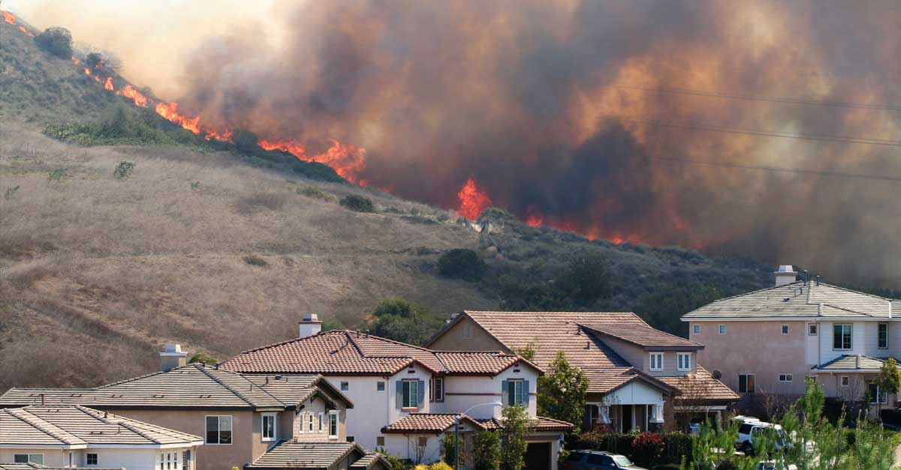
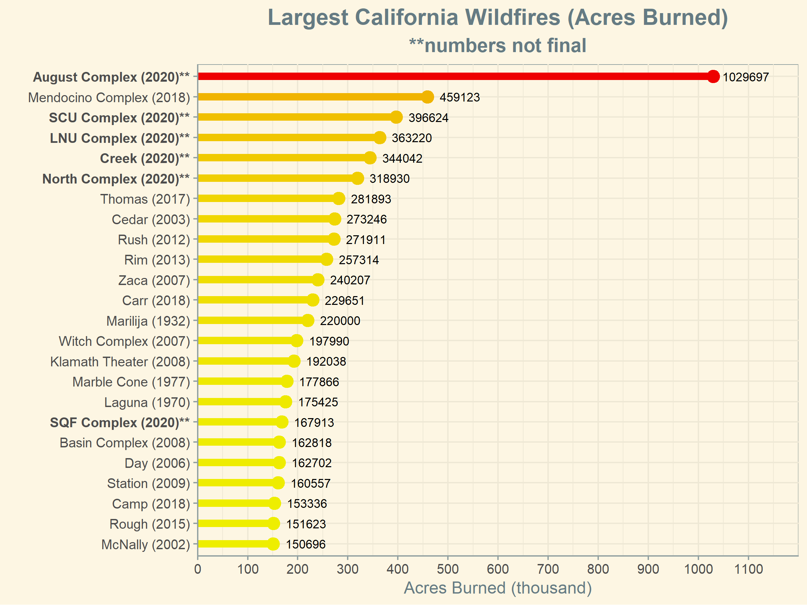
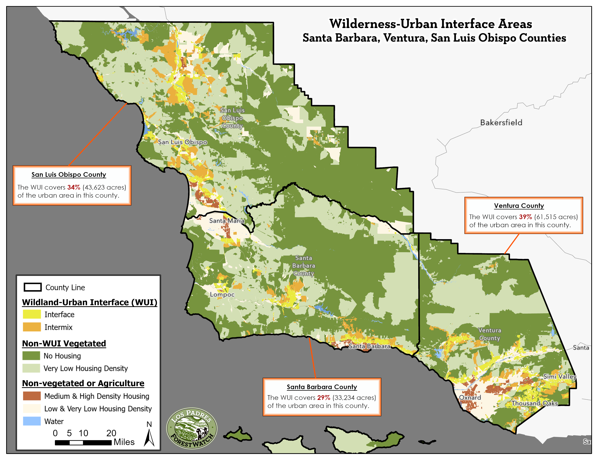
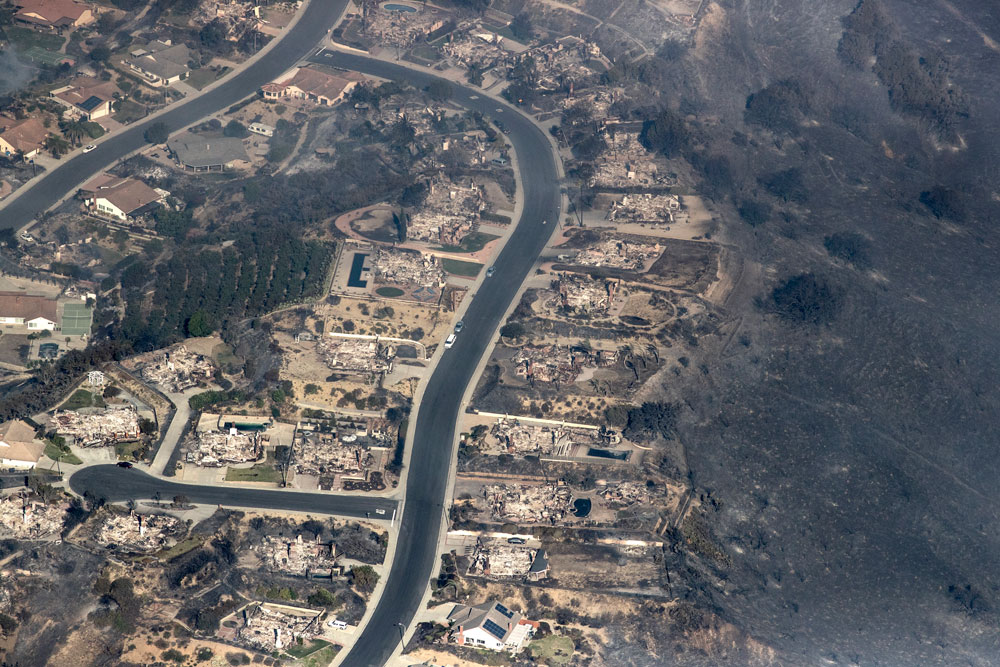

# **Living on the Edge**
## Exploring The Dangers of the Wilderness-Urban Interface in Santa Barbara, San Luis Obispo, and Ventura Counties

### <u>The WUI</u>

*The top 25 wildfires in California by size. All but one of the top 5 fires all burned in 2020*.

 *Wilderness-Urban Interface areas in San Luis Obispo, Santa Barbara, and Ventura counties.* 

*Examples of Interface and Intermix types of Wilderness-Urban Interface areas.*

------

### <u>Explore The Map</u>

Use the map above to explore these notable examples of the Central Coast's unrelenting expansion into the WUI; our unrelenting desire to live on the edge throughout the state is causing devastation in communities year after year due to catastrophic wildfire. 

#### Map Layer Descriptions:

**CAL FIRE 'Very High' Wildfire Hazard Severity Zones -**

The California Department of Forestry and Fire Protection (CAL FIRE) was directed to map areas of significant fire hazards based on fuels, terrain, weather, and other relevant factors throughout California. The map below shows the highest fire threat areas in State Responsibility Areas (SRAs), for which CAL FIRE is responsible for fire suppression. In addition, CAL FIRE releases recommendations to cities within Local Responsibility Areas (LRAs) where it determines 'Very High' fire threat classifications are warranted. 

**CPUC 'Extreme' Fire Hazard Severity Zones -**

Several of the worst wildfires were reportedly ignited by overhead utility power lines and aerial communication facilities in close proximity to power lines. In response to these wildfires, the California Public Utilities Commission (CPUC) initiated directives to consider and adopt regulations to protect the public from potential fire hazards associated with overhead powerline facilities and nearby aerial communication facilities. the CPUC also commenced the development of a single statewide fire-threat map to designate areas where (1) there is an elevated risk for destructive power line fires, and (2) where stricter fire-safety regulations should apply. 

**Historical Wildfire Perimeters -**

You can toggle on and off the footprints of historical wildfire by each decade within the legend. Click on a fire of interest to see its name, year it burned, and size in acres.

**Homes -**

New home construction occurring in 1994 or after as identified through Google satellite imagery. Layers were divided into those built in State Responsibility Areas (SRA) and Local Responsibility Areas (LRA).

****

<iframe src="jh_webmap/index.html" height=900 width=1200></iframe>

###  <u>Notable Examples</u>

***For each example, copy and paste the coordinates into the search box in the upper left corner of the map to center the map to the area of interest.***

#### <u>Painted Cave Fire (1990)</u>

#### **34.4623170 -119.7831377**

*Turn off the CAL FIRE Fire Hazard Severity Zones layer and turn on the Wildfire Perimeters (1990-1999) layer.* 

The Paint Fire burned in 1990 by severe winds eventually jumping the 101 freeway and burning in the affluent Hope Ranch neighborhood. The historical image below shows the devastation of the area after the Paint Fire burned through with most all of the houses reduced to rubble.

Today, the burned homes have long been rebuilt and what once was an empty field and possible fuel break has been turned into a new subdivision with even more homes in the path of another potential fire driven by sundowner winds.

#### <u>Scenic Way Dr., Ventura CA</u>

#### **34.294648 -119.201477** 

*Explore the area by toggling on and off the CAL FIRE Fire Hazard Severity Zones layer, CPUC Fire Hazard Severity Zones layer, and the Wildfire Perimeters (2010-2019) layer.* 

This neighborhood, a textbook example of the Interface WUI, was devastated in the 281,000 acre Thomas Fire in 2017. It lies within CAL FIRE and the CPUC's highest fire threat level zones.

*Scenic Way Dr. in Ventura, CA immediately after the Thomas Fire (Dec, 2017)*

Despite all this, houses in this neighborhood were being rebuilt once more only a year and half after this historic fire.

*Scenic Way Dr. in early 2019.*

#### <u>Bell Canyon, Ventura County</u>

#### **34.206723 -118.695030**

*Explore the area by toggling on and off the CAL FIRE Fire Hazard Severity Zones layer, CPUC Fire Hazard Severity Zones layer, and all the Wildfire Perimeters layers.* 

Bell Canyon in Ventura County has seen a major wildfire burn through the area nearly <u>every</u> decade and is also within CAL FIRE and the CPUC's highest fire threat level zones. Despite these facts, the Bell Canyon neighborhood continues to expand into the scrub that will most assuredly continue to burn more frequently and more severe.

------

### <u>The Path Forward</u>

How do we protect communities from wildfire? This question has a complex answer with many possible solutions. First and foremost, we need to redouble our efforts to reduce the number of wildfire ignitions. For example, the 2017 wildfire season showed that we need to start thinking about underground power lines in high-fire areas such as those identified in the map as CPUC 'Extreme' hazard for utility-related fires. We also need to ensure that our firefighters have all of the tools and emerging technologies they need to quickly detect wildfires as soon as they start, and to mobilize initial attack resources even more quickly than they already do.

In addition to the need for reducing wildfire ignitions, it is critical that California embraces smarter development practices such as:

- Avoiding building homes in fire-prone areas within the “wildland-urban interface”
- Increasing the pace, scale, and incentives of maintaining smart defensible space around structures
- Stricter code and enforcement regarding building or retrofitting homes using fire-safe materials

Development in the wildland urban interface is a growing side effect of urban sprawl in local cities. 
Too often, developments are approved in areas with significant fire risk. This puts considerable pressure on 
land managers to prevent fires from moving into these areas and threaten lives and property. 
Communities throughout California have long understood the need to avoid building in floodplains, and the same logic needs 
to be applied to building in areas at high risk for wildfire. Limiting the construction of homes and other buildings in 
areas of high fire risk can greatly mitigate wildfire damage in the future. Reducing development in fire-prone areas may 
also decrease the probability of human-caused ignitions there.

For homes and structures that already exist in areas at risk of being affected by wildfire, defensible space is a first step to better-protecting your home. Fire scientists recommend clearing vegetation no further than 100 feet from your buildings. Reducing woody vegetation immediately adjacent to structures by about 40% while also ensuring that other vegetation does not overhang or touch structures have been shown to be some of the best measures a homeowner in fire-prone areas can take.

During high-wind conditions, embers (also called “firebrands”) can be spread up to a mile or more, creating a dangerous situation where houses far away from the flames can ignite. Retrofitting existing homes or building new homes and structures with fire-safe materials can significantly reduce the risk of fire damage from firebrands. These steps include replacing roofing — one of the most vulnerable parts of your home — with non-wood materials such as fiberglass-asphalt shingles, metal sheets, clay tiles, or slate. Vents should also be covered with screens to inhibit ember entry into your home and they should be cleared of any vegetative debris on a regular basis. Other techniques include installing double-paned windows to reduce the heating of indoor materials from a fire outside and sealing all wall junctions and other potential points of entry for smoke and embers.

Going forward, our communities should rethink how — and whether — new development should be approved in the wildland urban interface. Homeowners already in fire-prone areas can take control of their home’s safety by replacing flammable wood shingles, installing double-pane windows, and installing innovative equipment designed to protect homes from fire such as rooftop sprinklers. All of these approaches have been shown to work time and again and they place the responsibility of protecting our communities on us collectively rather than placing the blame of wildfire destruction on our unique ecosystems.

## <u>Is Your Home At High Risk From Wildfire?</u>
#### If you live in the WUI it is not a matter of if but when the next wildfire will affect you. In an age of unprecedented fire weather and behavior, fire departments can do little to protect a structure that has not been properly prepared during a high-severity, wind-driven event. Learn how to better prepare your home at [Ready For Wildfire](https://www.readyforwildfire.org/).

